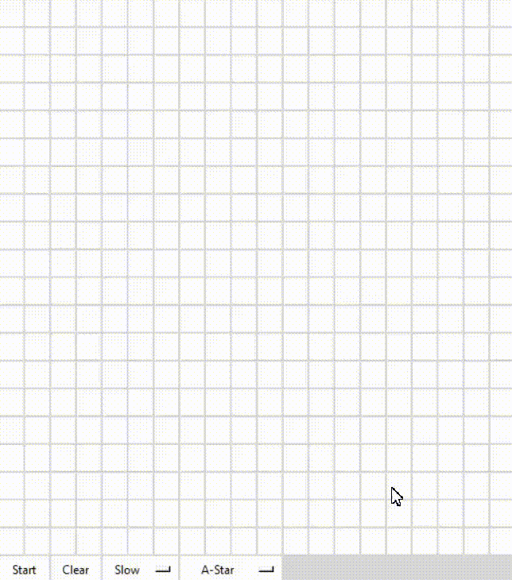

# Pathfinder
A pathfinding visualizer created using Python and tkinter.

### Getting started
- Run `src/main.py`.
- Enter the width (same as height) of the board.
- Click to select the starting and ending points.
- Drag to draw walls.
- Select an algorithm and start!

### Demo

- ***Blue*** boxes represent visited nodes.
- ***Green*** boxes represent discovered nodes.
- ***Yellow*** boxes represent the path.
